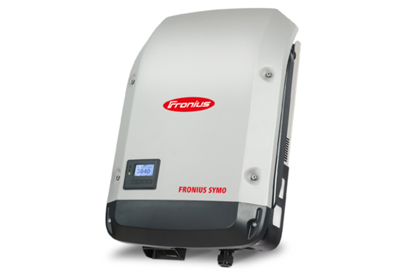

# Fronius Energy Consumption

Access PV live logs using the Fronius Solar API V1 and sends the values to a influx db.

# Description 

Java programm which reads the current power production of the fronius symo inverter. It sends the values to an influx db (the influx API v2 is used, which is compatible with Influxdb2 and Influxdb 1.x).

## Features 

Via Environment Variable (SHELLY.PLUGS.MANAGING) you can activate the management of shelly relays, to switch on or off e.g. the Shelly PLUG-S component. If the flag is active and the production is over the POWER.THRESHOLD value, it switches on the relay - if it goes down under the threshold, it switches the component off.

## Docker Image 

You can find the Docker image on [Docker Hub](https://hub.docker.com/repository/docker/pendl2/fronius-reader)

If you want to run a container, you can use the command `docker run pendl2/fronius-reader`

There are different tags available for common processor architectures:
* latest
* the project-version itself

If you have an ARM architecture, there is the following tag available:
* the project-version itself and the suffix `-arm7`

## Configuration 

Docker Environment Variable | Default | Description
------------ | ------------- | -------------
FRONIUS.HOST | fronius | The host where, the Fronius API is running
SHELLY.PLUGS | shelly-plug-s-1 | The Shelly PlugS host address
SHELLY.PLUGS.MANAGING | false | Flag to activate or deactive the shelly plugs
POWER.THRESHOLD | 3500 | Long value in Watt. If threshold is reached, it activates the Shelly Plug-S component
LOG.LEVEL | INFO | Log Level, can be switched to debug, for detailed information
INFLUXDB.HOST | localhost | The host where the influx service is running
INFLUXDB.PORT | 8086 | The port where the service is running
INFLUXDB.BUCKET | home  | The bucket
INFLUXDB.ORG | pendulum | The organisation which is sent to the InfluxDB
INFLUXDB.USER.TOKEN | | If set the token will be added to the request, if not, no authentication is used

Example:
setting the host 0.0.0.0 via environment: `sudo docker run -e FRONIUS.HOST=0.0.0.0 pendl2/fronius-reader`

## Multi-Container Configuration 

If you want to use a multi-container configuration (ARM Architecture), which contains containers for
* influx
* grafana
* fronius energy consumption (this project)

you can switch to this respository: [Multi Container Project](https://github.com/lukeSky3434/multi-container-arm)

# Open Points:

* Integrate the Shelly 3em energy meter
