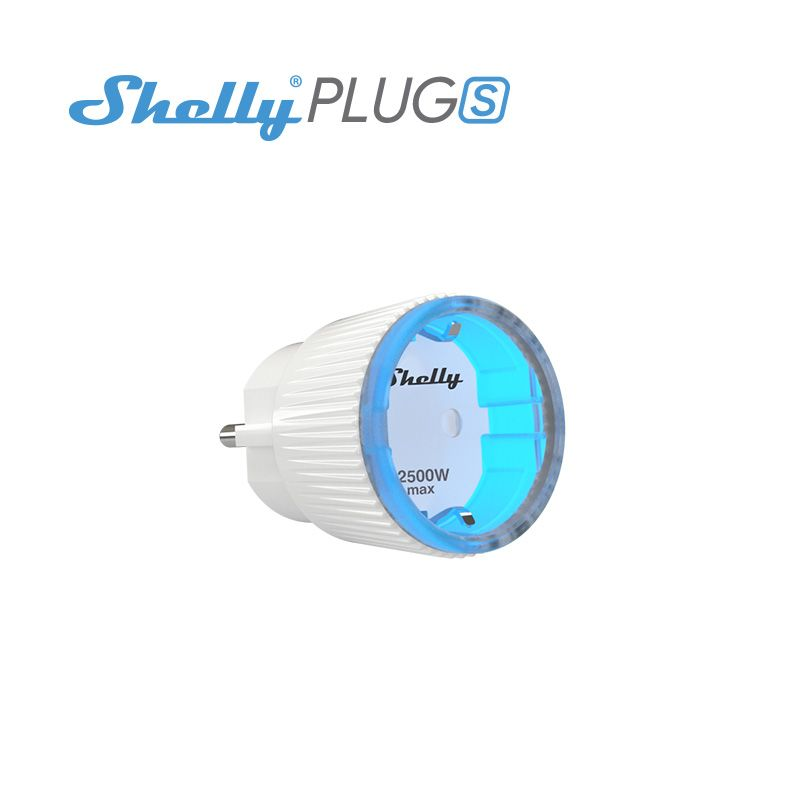

# Fronius Energy Consumption

Access PV live logs using the Fronius Solar API V1 and sends the values to a influx db.

# Description 

Java programm which reads the current power production of the fronius symo inverter. It sends the read values to a influx db (it uses the API v2, which is compatible with Influxdb2 and Influxdb 1.x).

## Features 

If the production is over the POWER.THRESHOLD value, it switches on the component Shelly PLUG-S - if it goes down under the threshold, it switches the component off.

## Docker Image 

Docker image is available here: [Image](https://hub.docker.com/repository/docker/pendl2/fronius-reader)

You can run the docker image with `docker run pendl2/fronius-reader`

There are tags for common processor architectures:
* latest
* the project-version itself

for ARM architectures:
* the project-version itself and the suffix `-arm7`

Docker Environment Variable | Default | Description
------------ | ------------- | -------------
FRONIUS.HOST | fronius | The host where, the Fronius API is running
SHELLY.PLUGS | shelly-plug-s-1 | The Shelly PlugS host address
SHELLY.PLUGS.MANAGING | false | Flag to activate or deactive the shelly plugs
POWER.THRESHOLD | 3500 | Long value in Watt. If threshold is reached, it activates the Shelly Plug-S component
LOG.LEVEL | INFO | Log Level, can be switched to debug, for detailed information
INFLUXDB.HOST | localhost | The host where the influx service is running
INFLUXDB.PORT | 8086 | The port where the service is running
INFLUXDB.BUCKET | home  | The bucket
INFLUXDB.ORG | pendulum | The organisation which is sent to the InfluxDB
INFLUXDB.USER.TOKEN | | If set the token will be added to the request, if not, no authentication is used

Example:
setting the host 0.0.0.0 via environment: `sudo docker run -e FRONIUS.HOST=0.0.0.0 pendl2/fronius-reader`

## Multi-Container Configuration 

If you want to use a multi-container configuration (ARM Architecture), which contains containers for
* influx
* grafana
* fronius energy consumption (this project)

you can switch to this respository: (Multi Container Project)[https://github.com/lukeSky3434/multi-container-arm]

# Open Points:

* Integrate the Shelly 3em energy meter
